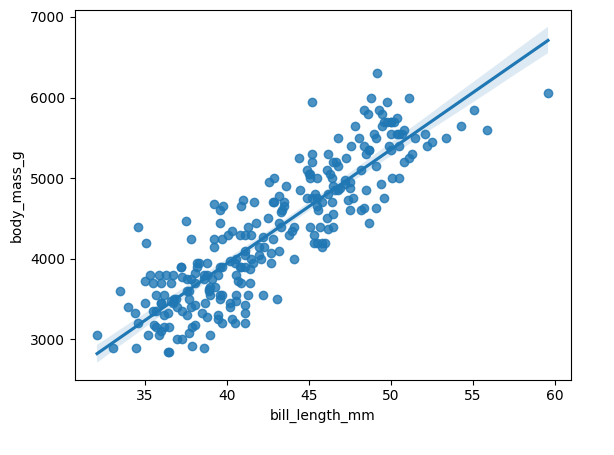

# 🐧 Modelo Predictivo de Masa Corporal en Pingüinos

**EDA + Regresión Lineal \| Proyecto de Análisis Predictivo**

------------------------------------------------------------------------

## 🧠 Sobre el Proyecto

Este proyecto aplica un enfoque analítico orientado a negocio para
evaluar si una única medida morfométrica ---la longitud del pico
(*bill_length_mm*)--- puede estimar con precisión la masa corporal de un
pingüino.

El objetivo es demostrar cómo un análisis simple puede generar **modelos
predictivos efectivos**, interpretables y reproducibles, útiles para
contextos científicos, operativos o educativos.

El proceso incluyó: - Exploración de correlaciones y relaciones entre
variables físicas\
- Identificación de patrones y distribución del dataset
- Construcción de un modelo de regresión lineal (OLS)
- Validación de supuestos estadísticos
- Comunicación ejecutiva mediante un *one-pager* visual

El modelo final explica el **76.9% de la variabilidad** de la masa
corporal.

------------------------------------------------------------------------

## 📊 Principales Resultados

-   Relación lineal fuerte entre la longitud del pico y la masa
    corporal.
-   Cada 1 mm adicional en el pico incrementa **\~141 g** de peso
    corporal.
-   R² = **0.769** confirma un modelo sólido.
-   La longitud de la aleta también muestra correlación relevante, útil
    para futuros modelos multivariables.

------------------------------------------------------------------------

## 🗂️ Estructura del Repositorio

    modelo-predictivo-masa-corporal/
    │
    ├── data/
    │   └── penguins.csv
    │
    ├── notebooks/
    │   └── Modelo Predictivo de Masa Corporal.ipynb
    │
    ├── reports/
    │   ├── PACE - Modelo Predictivo de Masa Corporal.pdf
    │   ├── Resumen_Ejecutivo.pdf
    │   └── Modelo Predictivo de Masa Corporal.pdf
    │
    ├── images/
    │   └── gráficos usados en el one-pager
    │
    ├── requirements.txt
    │
    └── README.md

------------------------------------------------------------------------

## 📄 Documentos del Proyecto

  -------------------------------------------------------------------------------------------------------------
  Tipo                         Archivo
  ---------------------------- --------------------------------------------------------------------------------
  📘 Notebook interactivo      [Modelo Predictivo de Masa
                               Corporal.ipynb](notebooks/Modelo%20Predictivo%20de%20Masa%20Corporal.ipynb)

  📄 PACE (Metodología)        [PACE - Modelo
                               Predictivo](reports/PACE%20-%20Modelo%20Predictivo%20de%20Masa%20Corporal.pdf)

  📊 Resumen Ejecutivo         [Resumen Ejecutivo](reports/Resume%20Ejecutivo.pdf) (One-Pager)                  

  🗂 Dataset                    [penguins.csv](data/penguins.csv)
  -------------------------------------------------------------------------------------------------------------

------------------------------------------------------------------------

## 🧪 Tecnologías y Librerías

-   Python 3
-   Pandas
-   NumPy
-   Seaborn
-   Matplotlib
-   Statsmodels
-   Scikit-Learn
-   Jupyter Notebook

Requisitos completos en:\
📦 **requirements.txt**

------------------------------------------------------------------------

## 📈 Visualizaciones

### 🔹 Pairplot — Relación entre variables morfométricas

**Muestra relaciones lineales claras entre medidas corporales, destacando la utilidad predictiva de la longitud del pico.**

---

### 🔹 Regresión Lineal — Longitud del Pico vs Masa Corporal

**Confirma una relación lineal positiva y sólida: picos más largos se asocian con mayor masa corporal.**

------------------------------------------------------------------------

## 🚀 Próximos Pasos

-   Integrar variables adicionales para un análisis multivariable.
-   Evaluar diferencias predictivas por especie.
-   Construir un dashboard interactivo para estimación rápida.
-   Probar modelos no lineales o machine learning para comparación.

------------------------------------------------------------------------

## 📬 Autor

**Frankz Camasca**\
Analista de Datos \| Data Analytics & Predictive Modeling\
GitHub: [@fcamasca](https://github.com/fcamasca)

------------------------------------------------------------------------
